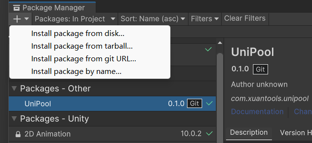

# UniPool

 

A tool of object pool with good performance and is easy to use for unity.

Instead of creating and destroying new objects all the time, this script reduces garbage by pooling instances, allowing you to seemingly create hundreds of new objects while only actually using a recycled few.

Temporarily incomplete, please switch to README.CN to get latest documents.

We will complete it as soon as possible, please be patient.

## Table of Contents

- [Getting started](#getting-started)
- [UniPool](#unipool)
- [UniPoolManager](#unipoolmanager)
- [Advanced Use](#advanced-use)
- [Installation](#installation)
- [Project](#project)
- [Performance](#performance)
- [License](#license)

## Getting started

## UniPool

## UniPoolManager

## Advanced Use

## Installation

### Install via git URL

Requires a version of unity that supports path query parameter for git packages (Unity >= 2019.3.4f1, Unity >= 2020.1a21).

You can add `https://github.com/XuanTools/UniPool.git?path=Assets/Plugins/UniPool` to Package Manager.

or add `"com.xuantools.unipool": "https://github.com/XuanTools/UniPool.git?path=Assets/Plugins/UniPool"` to `Packages/manifest.json`

If you want to set a target version, UniTask uses the `*.*.*` release tag so you can specify a version like `#0.1.0`. For example `https://github.com/XuanTools/UniPool.git?path=Assets/Plugins/UniPool#0.1.0`

## Performance

## Project

## License

[MIT](LICENSE) © Richard Littauer