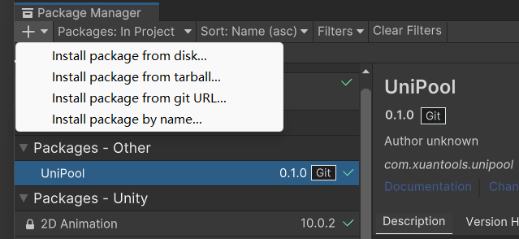

# UniPool

[](https://github.com/XuanTools/UniPool/blob/main/README.md) [](https://github.com/XuanTools/UniPool/blob/main/LICENSE)

一个为Unity的GameObject打造的，简单易用、性能优秀的对象池管理工具。

> 在游戏中会出现大量重复的物体需要频繁的创建和销毁；比如子弹，敌人，成就列表的格子等；频繁的创建与删除物体会造成很大的开销。

> UniPool能将需要频繁创建销毁的游戏对象缓存起来，将创建销毁行为替换成显示和隐藏，大大提高游戏运行效率。

UniPool简单易用、性能优秀的对象池管理工具，包含以下内容。

* UniPool对象池系统，缓存游戏对象，提升运行效率
* 单例类UniPoolManager，统一管理场景内物体的对象池
* 包含大量方便易用的扩展方法，能够便捷地对物体进行对象池操作
* 允许自定义地创建UniPool对象池，自定义委托，管理游戏物体的生成和回收

UniPool包含以下特性以提升性能或易用性。

* 延迟回收机制，优化同一帧内回收和获取大量物体时的性能
* 内部使用自定义集合类型HashPool，添加值、取值、判断包含等方法性能优秀
* 支持UGUI物体，能够正确识别物体实际Transform类型并使用正确的转换操作

## 目录

- [快速入门](#快速入门)
- [UniPool基础](#unipool基础)
- [UniPoolManager](#unipoolmanager)
- [进阶](#进阶)
- [安装](#安装)
- [工程](#工程)
- [性能](#性能)
- [License](#license)

## 快速入门

您可以通过以下简单的内容，快速了解UniPool的基础使用方法。

```
// 您无需引入其它命名空间，即可方便地使用扩展方法
GameObject prefab; // 预制体
SpriteRenderer spri; // 挂载在预制体上的组件

// 扩展方法依赖场景中的UniPoolManager单例，如果该单例不存在，在第一次调用扩展方法时会自动创建
void Start()
{
    // 预先创建对象池，可以提前加载物体和设置对象池最大数量，避免使用时大量加载造成的性能问题
    // 您可以在场景中的UniPoolManger单例上挂载初始对象池，也可以调用以下方法为物体创建对象池
    prefab.RegisterPool(100, 1000); // 为预制体创建对象池，指定初始大小和最大容量
}

void TestUniPool()
{
    // 生成物体，取代Instantiate()
    // 如果生成物体时不存在对象池，则会自动创建一个新的对象池
    GameObject obj1 = prefab.Spawn();
    SpriteRenderer obj2 = spri.Spawn(); // 组件与预制体拥有相同的扩展方法

    // 回收物体，取代Destroy()
    obj.Recycle();
}
```

## UniPool基础

UniPool是一个为GameObject设计的简单易用的对象池。

为什么要使用对象池？因为Instantiate()和Destroy()等方法会造成较大的性能开销，UniPool能缓存游戏对象，提升运行效率。

使用下面的构造方法为预制体创建UniPool对象池。

```
// 为prefab物体创建一个对象池，初始容量10，最大容量1000
var pool1 = new UniPool(prefab, 100, 1000);
// UniPool各阶段的委托可以自定义，若传入null则将使用UniPool默认的委托
var pool2 = new UniPool(prefab, 100, 1000, CreateFunc, ActionOnGet, ActionOnRelease, ActionOnDestroy);
```

UniPool内部使用HashPool\<GameObject>缓存生成的物体。

HashPool是一个自定义的集合类型，是精简版本的HashSet，其Add、Remove和Contain等方法消耗很小。

HashPool包含Get/GetToList等快速取值的方法，相比HashSet需要遍历或使用Linq，这些方法消耗更小。

```
// 精简版本的HashSet，包含更方便且消耗更小的取值函数
public class HashPool<T> : ICollection<T>, IPool<T>
```

可以使用下面的方法获取和回收物体，注意只能回收处于活动状态的物体（既已取出的物体），试图回收已回收的物体会引发一个错误。

```
// 从UniPool中取出一个物体并调用ActionOnGet委托，如果对象池中没有物体，则将调用CreateFunc委托创建一个新物体
var obj = pool.Get();

// 将物体放回UniPool中并调用ActionOnRelease委托，如果对象池已满，则再调用ActionOnDestroy委托销毁该物体
pool.Release(obj);
pool.Release(obj); // 寄了，抛出异常
```

如果需要，可以使用以下方法同时获取多个物体，这些方法更方便且消耗更小。

```
// 从UniPool中取出指定数量的物体并返回取出物体的列表，比多次调用Get方法消耗更小
var list = pool.GetList(10);

// 可以指定一个列表，让UniPool取出的物体添加到该列表中以避免创建一个新列表
// 两种同时获取多个物体的方法都有包含actionAfterGet参数的重载方法，可以为取出的每个物体执行想要的操作
pool.GetToList(list, 10, obj => Debug.Log(obj.name))
```

释放物体的委托（如常用的SetActive方法）可能造成一些开销，可以使用缓存方法，将物体暂时缓存在池中。

取出物体时将优先取出缓存状态的物体，这能避免释放时的开销（此时物体没有调用ActionOnRelease委托）

```
// 缓存物体进入对象池，不调用ActionOnRelease委托
pool.Cache(obj);
```

可以待到合适的时机再使用下面的方法将缓存的物体释放入池中（此时才会调用ActionOnRelease委托）

```
// 释放所有已缓存的物体，并调用ActionOnRelease委托
pool.CacheReleaseAll();
```

UniPool还另外内置一个HashSet\<GameObject>追踪生成的物体，您可以快速的对所有已取出的物体执行回收操作。

调用下列方法将释放或缓存所有取出的物体，但是您的代码中可能仍存在这些物体的引用，这可能导致一些问题，请谨慎使用这些方法。

```
// 释放所有已取出的物体
pool.SpawnedReleaseAll();

// 缓存所有已取出的物体
pool.SpawnedCacheAll();
```

UniPool只能管理由UniPool本身生成的物体，试图回收不属于该UniPool物体是不允许的，这将导致报错。

使用以下方法可以判断一个物体是否属于某个UniPool（包括回收、缓存和活动状态的物体）

```
// 判断物体是否属于此对象池
bool flag = pool.Contain(obj);
```

处在UniPool中的物体应完全由UniPool管理回收与销毁，不应该对属于UniPool的物体调用Destroy方法。

如果你销毁了属于UniPool的物体，UniPool会继续管理被销毁的物体，这将导致错误。

使用以下方法可以清除UniPool中已销毁的物体（正常使用UniPool无需调用此方法）

```
// 清除UniPool中已销毁的物体
pool.RemoveDestroyedObject();
```

UniPool包含以下属性（均为只读），可以通过这些属性获得UniPool的信息和状态。

```
// UniPool保存的预制体
var prefab = pool.Prefab;

// 属于UniPool的所有物体总数量
int count1 = pool.CountAll;
// UniPool已取出的物体的数量
int count2 = pool.CountActive;
// UniPool未取出的物体的数量（包括已回收和已缓存的物体）
int count3 = pool.CountInactive;

// 对象池能保存的最大物体数量
int size = pool.Maxsize;
```

UniPool使用完成后，可以使用以下方法销毁对象池。

```
// 清除所有非活动状态的物体（包括已回收和已缓存的物体）
pool.ClearPooled();

// 回收所有生成物体再释放UniPool，将导致所有物体被销毁
pool.ClearAll();

// 实现IDisposable接口，与ClearAll方法相同
pool.Dispose();
```

UniPool还包含了一个泛型版本UniPool\<T> where T : Component，可以使用该泛型版本方便地对组件类型进行管理。

泛型版本的方法参数值和返回值都为T类型，但其实是对组件所属的物体进行对象池操作的（无需频繁GetComponent\<T>或T.gameobject，更为优雅）

## UniPoolManager

UniPoolManager是一个管理场景中对象池的单例，其内部使用UniPool来缓存对象。

使用UniPoolManager可以方便地管理整个场景的对象。

* 场景内由同一个预制体生成的对象可以方便地由一个同一个UniPool进行管理

* 生成的所有物体与对应预制体的关系将被保存，用于方便地进行UniPool操作

* 回收的物体将被转移进UniPoolManager下的对应预制体目录中，保持场景目录整洁

* 延迟回收机制，回收物体时调用UniPool的Cache方法，在LateUpdate中统一调用CacheReleaseAll

以下为UniPoolManager包含的静态方法，使用它们进行对象池操作。

```
using XuanTools.UniPool;

// 注册对象池，可以指定初始容量与最大容量
UniPoolManager.RegisterPool(prefab, ..);

// 从该预制体的对象池中取出一个物体
UniPoolManager.Spawn(prefab, ..);
// 从该预制体的对象池中取出指定数量的物体
UniPoolManager.SpawnList(prefab, count, ..);
// 从该预制体的对象池中取出指定数量的物体到已存在的列表中
UniPoolManager.SpawnToList(prefab, list, count, ..);

// 回收对象池生成的物体，暂时缓存在对象池中
UniPoolManager.Recycle(obj);
// 直接回收对象池生成的物体到对应对象池中，不缓存该物体
UniPoolManager.RecycleImmediate(obj)

// 立即回收所有此预制体生成的物体，并缓存在对象池中
UniPoolManager.RecycleAll(prefab)
// 直接回收所有此预制体生成的物体，不缓存这些物体
UniPoolManager.RecycleAllImmediate(prefab)

// 获得该生成的物体对应的预制体
UniPoolManager.TryGetPrefab(obj, out prefab)
// 获得所有已注册对象池的预制体的列表
UniPoolManager.GetAllPooledPrefabs()

// 判断是否存在该预制体的对象池
UniPoolManager.ContainPool(prefab)
// 判断该物体是否由UniPoolManager生成
UniPoolManager.ContainObject(obj);

// 销毁该预制体对应对象池中已回收或已缓存的物体
UniPoolManager.DisposePooled(prefab)
// 销毁该预制体对应对象池生成的所有物体并销毁该对象池
UniPoolManager.DisposeAll(prefab)

// 将所有对象池缓存的物体释放入池中
UniPoolManager.CacheRecycleAll();
```

## 进阶

UniPool提供了许多易用的扩展方法，可以更优雅地调用UniPoolManager单例中的方法，无需导入命名空间即可使用。

下列表格展示了每个UniPoolManager中的静态方法所对应的UniPoolExtension扩展方法。

其中prefab表示需要用于生成物体的预制体，obj表示由UniPool生成的物体。

| UniPoolManager | UniPoolExtension | 
| --- | --- |
| `UniPoolManager.RegisterPool(prefab, ..)` | `prefab.RegisterPool(..)` |
| `UniPoolManager.Spawn(prefab, ..)` | `prefab.Spawn(..)` |
| `UniPoolManager.SpawnList(prefab, count, ..)` | `prefab.SpawnList(count, ..)` |
| `UniPoolManager.SpawnToList(prefab, count, ..)` | `prefab.SpawnToList(list, count, ..)` |
| `UniPoolManager.Recycle(obj)` | `obj.Recycle()` | 
| `UniPoolManager.RecycleImmediate(obj)` | `obj.RecycleImmediate()` |
| `UniPoolManager.RecycleAll(prefab)` | `prefab.RecycleAll()` |
| `UniPoolManager.RecycleAllImmediate(prefab)` | `prefab.RecycleAllImmediate()` |
| `UniPoolManager.ContainPool(prefab)` | `prefab.ContainPool()` |
| `UniPoolManager.ContainObject(obj)` | `obj.ContainObject()` |
| `UniPoolManager.DisposePooled(prefab)` | `prefab.DisposePooled()` |
| `UniPoolManager.DisposeAll(prefab)` | `prefab.DisposeAll()` |

## 安装

### 通过 git URL 安装

需要支持 git 包路径查询参数的 unity 版本（Unity >= 2019.3.4f1，Unity >= 2020.1a21）

您可以添加`https://github.com/XuanTools/UniPool.git?path=Assets/Plugins/UniPool`到包管理器。



或添加`"com.xuantools.unipool": "https://github.com/XuanTools/UniPool.git?path=Assets/Plugins/UniPool"`到`Packages/manifest.json`

如果要设置目标版本，UniPool 使用*.*.*发布标签，因此您可以指定一个版本，如#0.1.0. 例如`https://github.com/XuanTools/UniPool.git?path=Assets/Plugins/UniPool#0.1.0`

## 工程

项目工程包含了一个性能测试场景，用于对比Instantiate与ObjectPool和UniPool之间的性能差异。

同时还对比了UniPool中单独Spawn每一个物体以及使用SpawnList/SpawnToList之间的性能差异。

以下是作者在Unity编辑器中，每帧生成1000个物体并回收，使用Profilier测得的帧率数据，仅供参考。

| 模式 | 总平均帧率 | 相关代码平均耗时 | 相关代码GC |
| --- | --- | --- | --- |
| None | 500 | --- | --- |
| Instantiate | 42 | 10.3ms | 39.1KB |
| ObjectPool | 108 | 6.2ms | 0B |
| UniPool (Spawn) | 254 | 1.5ms | 0B |
| UniPool (SpawnToList) | 290 | 1.0ms | 416B |

建议不要开启Deep Profile模式，否则可能会导致使用UniPool模式测试得到的帧率大幅降低。

## 性能

UniPool的性能比一般对象池的性能好得多。

一般的对象池可能会使用SetActive或其它方式回收物体，这会造成一定消耗。UniPool的扩展方法Recycle并不直接回收物体，而是将其缓存在UniPool中，在该帧LateUpdate时才会被真正的回收。因此如果回收一个物体，在同一帧又生成了一个物体，那么就不会引起回收造成的消耗，相当于直接重新分配该物体。

在特定的场景（比如可以拖动进度条的场景）你可能需要在一帧内管理大量物体（比如1000个）并重新排列它们到正确的位置。使用UniPool的回收与生成功能，可以以很小的代价代替这种大量物体的管理与分配，使你的代码更为简洁高效。

在一般的场景（比如小怪的生成与回收）UniPool与一般的对象池性能无太大差异，但UniPool简单易用的扩展方法以及极高的可扩展性仍然能提升你的效率。

## License

此仓库基于[MIT](LICENSE)协议